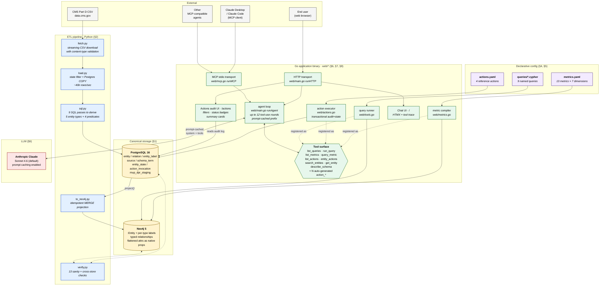
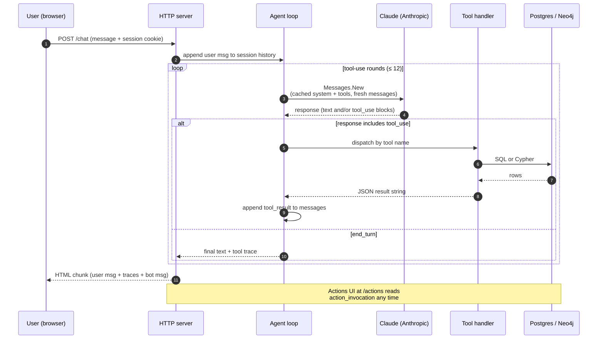

# Architecture diagrams

Visual companions to [features.md](features.md) and [../ARCHITECTURE.md](../ARCHITECTURE.md).
GitHub renders Mermaid natively — open this file in the GitHub UI to see the
diagrams.

---

## 1 · System architecture (with feature mapping)

Every box is a component that exists in the repo today. Labels in italics
are the features that component delivers; numbers in `§N` reference the
[features.md](features.md) sections.

### How to read it

- **Yellow** boxes are the two databases — the only persistent state.
- **Purple** boxes are declarative configuration files. Editing them and
  restarting the binary changes capability without code.
- **Blue** boxes are the Python ETL pipeline — runs out-of-band, not in the
  request path.
- **Green** boxes all live in one Go binary. The same compiled artifact runs
  as either an HTTP server (`./prescriber-bot.exe`) or an MCP stdio server
  (`./prescriber-bot.exe -mcp`) depending on a flag.
- **Red** is the only external dependency that costs money per call.
- The `Tool surface` hexagon is the **safety boundary** — agents cannot
  bypass it.

---

## 2 · A chatbot turn end-to-end

This is the sequence inside one user message. Most calls hit the prompt cache
and skip the expensive re-encoding of system + tools.

**Cost note:** steps 4–5 reuse the cached prefix (~3.8k tokens at ~10×
cheaper). Only the deltas — recent messages, tool results — pay full rate.

---

## 3 · Component → feature map

A table you can scan vertically. Cross-reference with [features.md](features.md)
for one-line value statements.

| Component | File(s) | Features delivered |
|---|---|---|
| Postgres schema | `db/postgres/migrations/0001_init.sql` | §1 entity/relation/source/schema_term, provenance |
| Postgres actions schema | `db/postgres/migrations/0002_actions.sql` | §5 entity_state + action_invocation tables |
| Docker compose stack | `docker-compose.yml` | §10 local Postgres + Neo4j + APOC |
| Python config | `src/ontology/config.py` | §10 env-driven, .env loading |
| Python DB clients | `src/ontology/db.py` | §1, §2 connection pooling for both stores |
| MeSH ingest | `src/ontology/ingest/mesh/*` | §2 alternate-dataset reference |
| Prescriber ingest | `src/ontology/ingest/prescriber/*` | §2 streaming load, COPY, derivation |
| Neo4j projector | `src/ontology/project/to_neo4j.py` | §1 idempotent MERGE, attr flattening |
| Verify suite | `src/ontology/verify.py` | §3 13 checks, pass/fail exit code |
| CLI entry point | `src/ontology/cli.py` | §10 init, load, project, verify, query |
| Metrics config | `metrics.yaml` | §4 13 metrics, 7 dimensions |
| Metric compiler | `web/metrics.go` | §4 Cypher composition, params |
| Hand-written queries | `queries/*.cypher` | §4 9 named queries |
| Query runner | `web/tools.go` | §4 run_query dispatch |
| Actions config | `actions.yaml` | §5 4 reference actions |
| Action executor | `web/actions.go` | §5 validation, substitution, transactional apply |
| Web chatbot | `web/main.go` runHTTP | §6 HTMX UI, session state, prompt cache |
| Agent loop | `web/main.go` runAgent | §6 tool-use loop, usage logging |
| MCP server | `web/mcp.go` runMCP | §7 stdio transport, tool mirror, instructions |
| Actions UI | `web/actions_ui.go` + `web/templates/actions.html` | §8 audit log browser |
| Chat template | `web/templates/index.html` | §6 chat input + tool trace render |
| Smoke test seed | (manual via MCP stdio) | §3 end-to-end check |

---

## 4 · What this diagram does NOT show

These exist as plans, not as code yet — see [features.md](features.md)
"planned but not built" section.

- **Events tier** (`change_event` + LISTEN/NOTIFY consumer) — would sit
  between Postgres and Neo4j, replacing the manual `project` arrow
- **`pgvector`** index on `entity.canonical_label` — would wire into
  `search_entities` for semantic resolution
- **Tool-call telemetry** — a `tool_call_log` table fed by the agent loop
- **Eval harness** — a fixture file + runner that exercises the tool surface
  and reports pass/fail
- **Idempotency keys** — a new column on `action_invocation`
- **Result caching** — TTL'd LRU between the agent and the metric compiler

Adding any of these is additive to the diagram, not a redesign.
