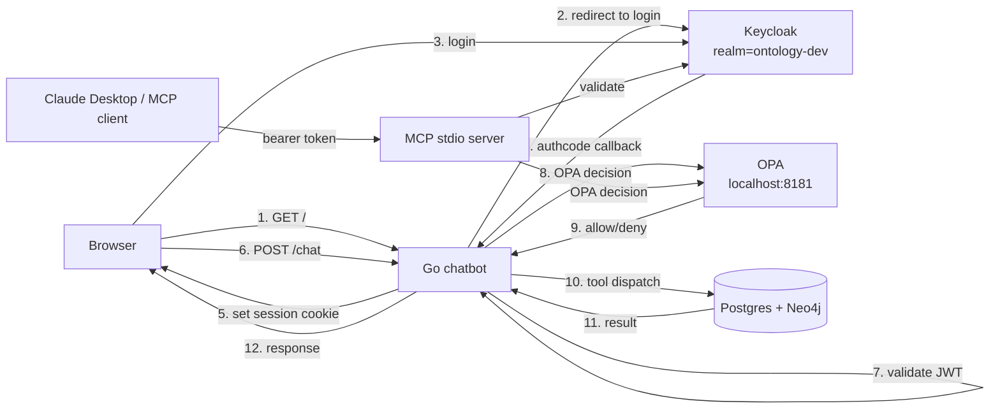

# Plan: Keycloak + OPA (Open Policy Agent) integration

**Status:** Proposed — awaiting decisions on open questions before build
**Estimated effort:** ~3 days for v1 (4-phase delivery, each phase shippable)
**Owner:** TBD
**Related:** [actions-plan.md](actions-plan.md), [events-plan.md](events-plan.md), [ARCHITECTURE.md](../ARCHITECTURE.md)

---

## Goal

Replace "trust the caller" with **authenticated users + policy-driven authorization**, so the platform can plausibly run inside a regulated organization. Keycloak owns *who you are*; OPA owns *what you can do*.

End state after v1:

- Anonymous browsing of `/`, `/healthz` is allowed; everything else requires login
- Every tool call goes through an OPA decision; the decision is logged alongside the call
- Actions can be gated by role + parameters (e.g., *"only `senior_compliance` can flag with severity=high"*)
- The MCP server requires a service-account bearer token
- `action_invocation` records the real user, not `agent:claude`
- Multi-tenancy story exists (Keycloak realm = tenant boundary) even if only one realm is configured at launch

## What's in v1

1. Keycloak running locally as a Docker service with a pre-seeded realm
2. OPA running as a sidecar with a `policies/` directory mounted
3. JWT validation middleware in the Go chatbot (OIDC login flow → session cookie)
4. Per-tool-call authorization via OPA (HTTP decision endpoint)
5. Per-action authorization via OPA (with `input.params` visible to policies)
6. MCP server: optional bearer token verification (env-configurable)
7. User identity propagated through `WithCallContext` → recorded on `action_invocation.actor` and `tool_call_log.actor`
8. Sample Rego policies covering tools and actions

## What's explicitly out of scope for v1

- Federated identity providers (AD, Google, GitHub) — Keycloak supports them; configure later
- Approval workflows for high-risk actions (the *"requires_approval"* pattern)
- Row-level / data-scope filters via OPA partial evaluation
- Token refresh inside long-running MCP sessions
- Multi-region Keycloak clustering
- Audit certifications (SOC 2, HIPAA scoping)
- SSO across multiple apps (we're a single-app deployment)

These are deferred to v2 and documented as known limitations.

---

## Concepts

| Term | Meaning |
|------|---------|
| **Keycloak realm** | A tenant boundary: users, roles, clients, sessions. We launch with one realm (`ontology-dev`); add more later. |
| **OIDC client** | An app registered with Keycloak. Two clients: `ontology-web` (public, for browser flow) and `ontology-mcp` (confidential, for service-account tokens). |
| **Role** | A label assigned to users or groups (`viewer`, `analyst`, `compliance`, `senior_compliance`, `admin`). |
| **Claim** | A field inside the JWT (sub, email, name, groups, roles). |
| **OPA decision** | A boolean (with optional explanation) returned by OPA when asked *"can user X do action Y on target Z?"* |
| **Rego** | OPA's policy language. Files live in `policies/*.rego` and load on Postgres start. |

### Design decision: separate AuthN from AuthZ

Keycloak issues JWTs (authentication). Our Go service verifies them (still authentication). OPA evaluates *policy* against the verified claims + the requested action (authorization). Decoupling means we can change auth providers or policy without touching the other.

---

## Architecture sketch



---

## Components

### 1. Keycloak

Added to `docker-compose.yml`:

```yaml
keycloak:
  image: quay.io/keycloak/keycloak:26.0
  environment:
    KC_BOOTSTRAP_ADMIN_USERNAME: admin
    KC_BOOTSTRAP_ADMIN_PASSWORD: ${KEYCLOAK_ADMIN_PASSWORD:-keycloak-dev}
    KC_DB: postgres
    KC_DB_URL: jdbc:postgresql://postgres:5432/keycloak
    KC_DB_USERNAME: ${POSTGRES_USER:-ontology}
    KC_DB_PASSWORD: ${POSTGRES_PASSWORD:-ontology}
    KC_HOSTNAME: localhost
    KC_HTTP_ENABLED: "true"
  command: ["start-dev", "--import-realm"]
  ports: ["8180:8080"]
  volumes:
    - ./auth/keycloak/realms:/opt/keycloak/data/import:ro
  depends_on:
    postgres:
      condition: service_healthy
```

A `keycloak` database is added to Postgres (separate from `ontology` to keep schemas tidy).

A seed realm export lives at `auth/keycloak/realms/ontology-dev-realm.json`. It defines:

- Realm `ontology-dev`
- Two clients: `ontology-web` (public) and `ontology-mcp` (confidential)
- Five roles: `viewer`, `analyst`, `compliance`, `senior_compliance`, `admin`
- Three test users with assorted role assignments

### 2. OPA

```yaml
opa:
  image: openpolicyagent/opa:1.0.0-rootless
  command:
    - "run"
    - "--server"
    - "--addr=0.0.0.0:8181"
    - "--log-format=json"
    - "/policies"
  ports: ["8181:8181"]
  volumes:
    - ./auth/policies:/policies:ro
```

OPA loads every `.rego` file in `/policies` on startup. Live-reload on change is supported via the `--watch` flag — useful in dev.

### 3. Policy library — `auth/policies/`

```
auth/policies/
├── tools.rego        # which tools can each role call
├── actions.rego      # which actions, with which param values
└── helpers.rego      # shared role-check helpers
```

Sample `tools.rego`:

```rego
package ontology.tools

import rego.v1

default allow := false

# Read-only tools: every authenticated user
read_only := {
    "list_queries", "run_query",
    "list_metrics", "query_metric",
    "list_actions", "entity_actions", "entity_lineage",
    "search_entities", "get_entity", "describe_schema",
}

allow if {
    input.tool in read_only
    input.user.authenticated
}

# Write tools (action_*): require role:compliance or above
allow if {
    startswith(input.tool, "action_")
    some r in input.user.roles
    r in {"compliance", "senior_compliance", "admin"}
}
```

Sample `actions.rego`:

```rego
package ontology.actions

import rego.v1

default allow := false

# add_note: any authenticated user
allow if {
    input.action == "add_note"
    input.user.authenticated
}

# Standard flag_for_review (low/medium severity): compliance role
allow if {
    input.action == "flag_for_review"
    input.params.severity in {"low", "medium"}
    "compliance" in input.user.roles
}

# High-severity flag: must be senior_compliance or admin
allow if {
    input.action == "flag_for_review"
    input.params.severity == "high"
    some r in input.user.roles
    r in {"senior_compliance", "admin"}
}

# unflag: same role as flag
allow if {
    input.action == "unflag"
    "compliance" in input.user.roles
}

# add_to_watchlist: compliance or admin
allow if {
    input.action == "add_to_watchlist"
    some r in input.user.roles
    r in {"compliance", "admin"}
}
```

The policy is **deny by default**. Anything not matched is denied.

### 4. Go-side integration

```
web/
├── auth.go              # NEW: JWT validation, OIDC login flow, session cookie
├── opa.go               # NEW: OPA client (HTTP), decision caching (LRU + 30s TTL)
├── main.go              # MODIFIED: middleware wraps every handler
└── ...
```

`auth.go`:

```go
// User identity recovered from a verified JWT.
type User struct {
    Subject       string   // sub claim (stable user ID)
    Email         string
    Name          string
    Roles         []string // realm_access.roles + resource_access.<client>.roles
    Authenticated bool
}

// VerifyJWT checks signature against Keycloak's JWKS, validates expiry +
// issuer + audience, extracts claims into a User.
func VerifyJWT(ctx context.Context, token string) (*User, error)

// authMiddleware ensures every request has a verified User in context.
// Public paths (/, /healthz, /auth/*) are exempted.
func authMiddleware(next http.Handler) http.Handler
```

`opa.go`:

```go
type Decision struct {
    Allow  bool
    Reason string // optional explanation from policy
}

// Decide asks OPA "is this user allowed to perform this tool/action?"
func Decide(ctx context.Context, packageName string, input map[string]any) (Decision, error)
```

`executeTool` and `executeAction` are wrapped:

```go
func executeTool(ctx context.Context, name, inputJSON string) (string, bool) {
    user := userFromContext(ctx)
    decision, err := Decide(ctx, "ontology/tools/allow", map[string]any{
        "user": user,
        "tool": name,
    })
    if err != nil || !decision.Allow {
        return fmt.Sprintf("denied by policy: %s", decision.Reason), true
    }
    // ... existing logic
}
```

### 5. Login flow

- `GET /auth/login` → 302 to Keycloak's OIDC authorize endpoint
- `GET /auth/callback?code=...` → exchanges code for tokens, sets HTTP-only session cookie, redirects to `/`
- `GET /auth/logout` → clears cookie + redirects to Keycloak end-session URL
- Cookie stores a session ID that maps to the access + refresh tokens in an in-process map (sync.Map) for v1; replace with Redis later

### 6. MCP authentication

The MCP server reads `MCP_SERVICE_TOKEN` from environment. Every JSON-RPC request must include the token in either:

- An `Authorization: Bearer <token>` header (when running over HTTP)
- The first `initialize` request as a `meta.authorization` field (for stdio)

If unset, the MCP server runs with implicit admin role (existing behavior — useful for local dev).

### 7. User context propagation

```go
ctx = WithCallContext(ctx, user.Subject, sessionID, "http")
```

The `actor` field on `tool_call_log` and `action_invocation` now records the real user's Keycloak subject ID (e.g., `f47ac10b-58cc-...`) instead of `agent:claude`. The actor display in the UI joins back to Keycloak to show display name + email.

### 8. OPA decision telemetry

Every Decide call writes to a new `opa_decision_log` table (or extends `tool_call_log` with an `opa_allow`, `opa_reason` column):

```sql
ALTER TABLE tool_call_log
    ADD COLUMN opa_allow   BOOLEAN,
    ADD COLUMN opa_reason  TEXT;
```

The `/telemetry` page gains a "Denied" filter.

---

## Data model

```sql
-- Already exists: action_invocation, tool_call_log, etc. Just one column
-- gets added.

ALTER TABLE tool_call_log
    ADD COLUMN opa_allow  BOOLEAN,
    ADD COLUMN opa_reason TEXT;

-- And one new table — user mirror (cached from Keycloak so we can render
-- display names without round-tripping for every audit row).
CREATE TABLE user_cache (
    subject     UUID PRIMARY KEY,
    email       TEXT,
    name        TEXT,
    roles       TEXT[] NOT NULL DEFAULT '{}',
    updated_at  TIMESTAMPTZ NOT NULL DEFAULT now()
);
```

Migration filename: `db/postgres/migrations/0008_auth.sql`.

---

## Code surface

```
docker-compose.yml                    # +keycloak +opa services
.env.example                          # +KEYCLOAK_* +MCP_SERVICE_TOKEN

auth/                                 # NEW directory
├── keycloak/realms/
│   └── ontology-dev-realm.json       # importable realm definition
└── policies/
    ├── tools.rego
    ├── actions.rego
    └── helpers.rego

db/postgres/migrations/
└── 0008_auth.sql                     # tool_call_log gains opa_allow/reason; user_cache table

web/
├── auth.go                           # NEW: JWT verification, OIDC login flow, session storage
├── opa.go                            # NEW: HTTP client to OPA + LRU decision cache
├── main.go                           # MODIFIED: authMiddleware on /chat, /actions, /telemetry, /lineage
├── tools.go                          # MODIFIED: executeTool checks OPA before dispatch
├── actions.go                        # MODIFIED: executeAction checks OPA after target resolution
└── templates/
    ├── index.html                    # MODIFIED: shows logged-in user, logout link
    └── login.html                    # NEW: simple landing-page-style screen
```

---

## Phased delivery

| Phase | Scope | Effort |
|-------|-------|--------|
| **1. Infrastructure** | Docker-compose for Keycloak + OPA; seed realm with 3 users + 5 roles; sample tools.rego / actions.rego that compile and answer test queries via `opa eval` | ~4 hours |
| **2. Authentication** | JWT verification middleware; OIDC redirect flow; session cookie; `/auth/login` and `/auth/callback`; bearer-token mode for MCP; logged-in-user pill in chat header | ~1 day |
| **3. Authorization** | OPA HTTP client + LRU cache; wrap executeTool + executeAction; deny path returns clear error; surface OPA decision in chat trace; extend tool_call_log with opa_allow + opa_reason | ~1 day |
| **4. Polish + docs** | Sample policies for all 4 reference actions + 7 read tools; user-cache materializer; /telemetry "Denied" filter; update [ARCHITECTURE.md](../ARCHITECTURE.md) and [README.md](../README.md); demo runbook entry showing role-gated behavior | ~4 hours |

**Total: ~3 days.** Each phase is independently shippable; phase 1 alone gives you a running policy engine you can play with via `opa eval`.

---

## User-facing change

**Before:** anyone reaching `:8081` gets full read + write access. Audit log says `agent:claude`.

**After phase 4:**

1. Visit `http://localhost:8081/` → redirected to `http://localhost:8180/realms/ontology-dev/protocol/openid-connect/auth` (Keycloak)
2. Login as `alice@example.com` (role: `analyst`)
3. *"Show me top 5 cardiology drugs"* → works (read tool is in `read_only` set)
4. *"Flag NPI 1427277136 for review with severity=high"* → **denied** by `actions.rego` because Alice isn't `senior_compliance`. The chat trace shows: `→ action_flag_for_review(...)` then `← denied by policy: severity=high requires senior_compliance role`.
5. Logout, login as `bob@example.com` (role: `senior_compliance`)
6. Same flag request now succeeds; `action_invocation.actor` = Bob's Keycloak subject UUID
7. `/telemetry` page shows the rejected attempt with `opa_allow=false`

---

## Risks and mitigations

| Risk | Mitigation |
|------|------------|
| Keycloak realm setup is finicky | Ship a curated realm export under `auth/keycloak/realms/`; `--import-realm` reproduces it deterministically |
| OIDC flow adds latency on first request | Acceptable; only first request per session redirects |
| OPA decision adds per-call latency | LRU cache with 30s TTL on the decision; cache key is `(user.sub, tool/action, params hash)` |
| Rego learning curve | Provide working sample policies that map directly to the action library; document the `opa eval` development loop |
| MCP authentication breaks Claude Desktop's "just works" UX | Make MCP_SERVICE_TOKEN optional with a clear "unauthenticated mode" warning in startup log |
| Token expiry mid-conversation | v1: re-redirect to login on 401; v2: implement refresh-token flow |
| Two new containers raise local-dev memory floor | ~600 MB combined (Keycloak ~400, OPA ~150); document the requirement in [README.md](../README.md) |
| Existing single-user setup breaks | Keycloak is opt-in via env var `AUTH_PROVIDER=keycloak`; default remains `none` for local dev convenience |

---

## Open decisions

1. **Default policy: deny vs. allow.**
   *Default: deny.* Standard security posture; explicit rules whitelist actions.

2. **MCP authentication: required, optional, or off?**
   *Default: optional via `MCP_SERVICE_TOKEN`*. Implicit admin if unset (preserves existing local-dev UX). Document the security implication.

3. **OPA in-process (Go lib) vs HTTP sidecar?**
   *Default: HTTP sidecar.* Slower per call (network hop), but lets policies be edited without rebuilds and matches the standard OPA deployment pattern.

4. **Session storage: in-process map vs Postgres vs Redis?**
   *Default: in-process map for v1.* Cookies tied to a `sessions sync.Map` like today. Single-instance only. v2: move to Postgres (composes with the existing events tier) or Redis.

5. **Where do roles live: Keycloak realm roles, client roles, or groups?**
   *Default: realm roles.* Simplest; flat namespace. v2 could add group hierarchies for delegated admin.

6. **User-cache freshness?**
   *Default: refresh on login + lazy refresh older than 1 hour.* Avoids hitting Keycloak on every audit log query. Stale roles take ≤ 1 hour to propagate.

---

## Verification plan

Before declaring v1 done, all of these must pass:

- [ ] `docker compose up -d` brings up Postgres + Neo4j + Keycloak + OPA all healthy
- [ ] `opa eval -d auth/policies/ -i test/input/alice_run_query.json 'data.ontology.tools.allow'` returns `true`
- [ ] Visiting `/` unauthenticated redirects to Keycloak login
- [ ] After successful login, the chat page renders with the user's name in the header
- [ ] `alice` (analyst) calling `query_metric` succeeds; row in `tool_call_log` has her subject UUID and `opa_allow=true`
- [ ] `alice` calling `action_flag_for_review` is denied; row in `tool_call_log` has `opa_allow=false` and the policy reason
- [ ] `bob` (senior_compliance) calling the same action succeeds
- [ ] MCP server with `MCP_SERVICE_TOKEN` unset logs a "running in unauthenticated mode" warning
- [ ] MCP server with the token set rejects requests without the bearer token
- [ ] `/telemetry` page filter on `status=error` includes denied calls with their policy reason inline
- [ ] Logout flow clears the cookie and redirects to Keycloak's end-session URL
- [ ] `ontology verify` still passes (none of the existing checks regress)

---

## Beyond v1

Natural follow-ons:

- **Federated identity** — point Keycloak at AD/Google/Okta as an upstream IdP; users authenticate against their existing corporate account
- **Token refresh** — refresh-token loop so sessions last beyond the access-token expiry (currently 15 min default)
- **Per-realm data scope** — every entity carries a `tenant` column; OPA partial evaluation rewrites Postgres queries with a `WHERE tenant = $user.tenant` filter
- **Approval workflows** — actions with `requires_approval: true` go to `status='pending_approval'` and wait for a second user to sign off; ties into the events tier
- **OPA bundles** — replace file-mounted policies with a bundle server (S3 / OCI registry / Git), with signed bundle verification
- **Audit certifications** — SOC 2 controls map cleanly to what we now log (every action, every tool call, every policy decision)
- **Per-action rate limiting via OPA** — `default allow := false; allow if not over_limit` with `over_limit := count(recent_invocations) > 10`
- **Skills + playbooks gated by role** — *"only senior_compliance can run the deep_review playbook"*
