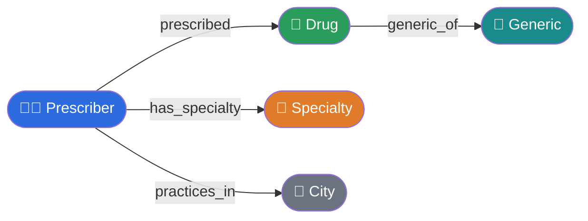
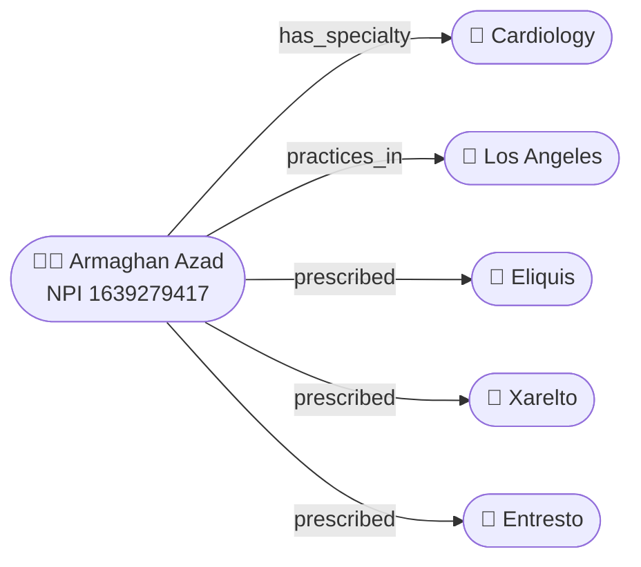
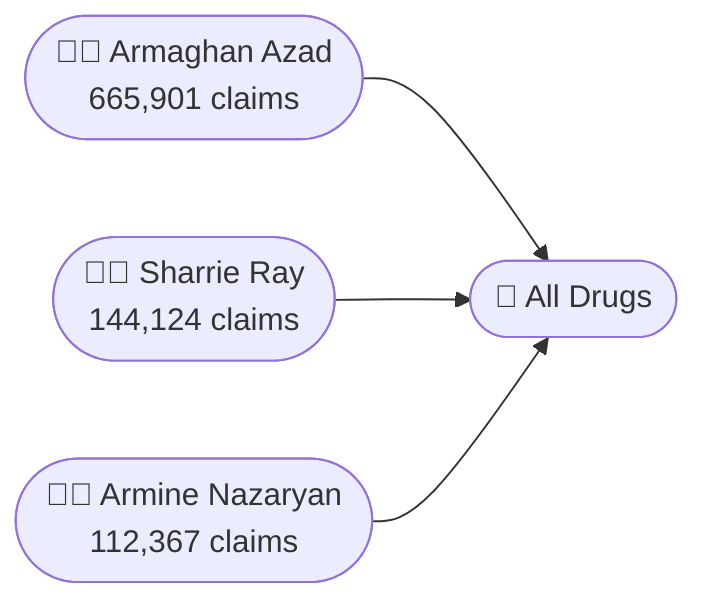

# Ontology Graph Presentation & Explainer Enhancement — Plan

## Problem

Tool call traces render as raw JSON strings in yellow boxes — unreadable for
non-technical audiences. There is no visual explanation of what a knowledge
graph or ontology is, which is a stated goal of this project for product owners
and business leaders.

---

## Design Foundation: The Triple Strip

The fundamental unit of a knowledge graph is the **triple**:
**subject → predicate → object**

Every query the system runs traverses one or more of these edges. The UI
should make that traversal visible — not as an explanation layered on top, but
as the natural header of every tool call result. The concept teaches itself
through repeated exposure.

Each tool trace header shows a **relationship path strip**: color-coded entity
chips connected by labeled arrows that map directly to the Neo4j data model:

```
[🧑‍⚕️ Prescriber] ──── prescribed ────▶ [💊 Drug]   ·  25 results
```

Multi-hop queries extend naturally:

```
[🧑‍⚕️ Prescriber] ── prescribed ──▶ [💊 Drug] ◀── prescribed ── [🧑‍⚕️ Prescriber]
```

### Entity color vocabulary (used consistently across all components)

| Entity type | Color | Emoji |
|---|---|---|
| Prescriber | Blue (`#2d6cdf`) | 🧑‍⚕️ |
| Drug (brand) | Green (`#2a9d5c`) | 💊 |
| Generic substance | Teal (`#1a8a8a`) | 🧪 |
| Specialty | Orange (`#e07b2a`) | 🏥 |
| City / Location | Grey (`#6b7280`) | 📍 |

This vocabulary is shared by the inline strip, the Mermaid schema overlay, and
any dynamic graph diagrams — so the visual language is unified across the whole
app.

---

## Component 1 — Tool Trace Redesign

### Current state
`toolTrace []string` alternates between call strings (`→ tool(params)`) and
result strings (`← {json}`), each rendered as a full-width yellow
`<div class="msg tool">` block with `white-space: pre-wrap`.

### Proposed state

**Data structure change** — `web/main.go`:
```go
type toolCall struct {
    Name   string
    Input  string // raw JSON params
    Result string // raw JSON result, truncated
}
```
`runAgent` returns `[]toolCall` instead of `[]string`.

**Rendering** — each `toolCall` produces a single `<details>` element:

```
┌─────────────────────────────────────────────────────────────┐
│ ▶  [🧑‍⚕️ Prescriber] ── prescribed ──▶ [💊 Drug]  · 25 results │  ← <summary>, collapsed by default
└─────────────────────────────────────────────────────────────┘
    ┌──────────────────────┬──────────────────────────────────┐
    │ run_query            │ {"query":"top_prescribers_by_    │
    │ name: top_           │  claims","row_count":25,"rows":  │
    │ prescribers_by_      │  [{"npi":"163927...             │
    │ claims               │                                  │
    └──────────────────────┴──────────────────────────────────┘
    ↑ expanded view: params left, truncated result right
```

**Strip generation** — a `tripleStrip(toolName, inputJSON string) string`
function in a new `web/graph_viz.go` maps each tool + key param to its
ontology path:

| Tool call | Strip |
|---|---|
| `run_query(top_prescribers_by_claims)` | `[Prescriber] ── prescribed ──▶ [Drug]` |
| `run_query(co_prescribed)` | `[Prescriber] ── prescribed ──▶ [Drug] ◀── prescribed ── [Prescriber]` |
| `query_metric(group_by=specialty)` | `[Prescriber] ── has_specialty ──▶ [Specialty]` |
| `query_metric(group_by=drug)` | `[Prescriber] ── prescribed ──▶ [Drug]` |
| `search_entities` / `get_entity` | `[Entity]` (single node, no traversal) |
| `describe_schema` | `Full schema` |
| `action_*` | `[Entity] ── state_update ──▶ [EntityState]` |

**Styling** — replaces the flat yellow block:
- Compact `<details>`/`<summary>` element
- Muted left-border accent (amber, 3px) instead of full background fill
- Summary line: small font, entity chips as inline `<span>` with colored
  background, arrow glyphs between them
- Expanded panel: two-column layout, monospace result, max-height with scroll

---

## Component 2 — Static Ontology Schema Overlay

A **"View Knowledge Graph"** button in the chat header. Clicking opens a modal
overlay with two tabs.

### Tab 1 — Schema diagram (Mermaid)



### Tab 2 — Plain-English explainer

> A **knowledge graph** stores facts as *nodes* (things) and *edges*
> (relationships between things).
>
> This graph has **114,815 nodes** and **2,679,499 edges** covering California's
> Medicare Part D prescribers in 2023.
>
> When you ask *"who prescribes Eliquis the most?"* the system traverses the
> graph along the **:prescribed** edge — starting at all Prescriber nodes,
> following edges to the Eliquis Drug node, and summing claim counts.
>
> Every number in an answer is sourced directly from that traversal. Nothing
> is inferred or estimated.

### Implementation notes
- `mermaid.js` loaded from CDN (no build step)
- Modal is pure CSS + ~25 lines of vanilla JS
- Button added to `<header>` nav alongside existing Actions/Telemetry/Lineage
  links
- Tab switching is CSS-only (`:checked` on hidden radio inputs)

---

## Component 3 — Per-Result Dynamic Graph Preview

A **"View as Graph"** button appended to bot responses where the underlying
tool call was `get_entity` or `run_query`. Clicking opens the same modal with
a Mermaid diagram generated from the actual result data.

### `get_entity` result → subgraph

For a single prescriber lookup, show the entity and its immediate neighborhood:



### `run_query(top_prescribers_by_claims)` result → ranked nodes



### Server-side generation

New function in `web/graph_viz.go`:
```go
func toMermaid(toolName, inputJSON, resultJSON string) string
```

Pattern-matches on `toolName`, parses `resultJSON`, caps node count at 10 to
keep diagrams readable. Returns a Mermaid `graph LR` string with entity
classDefs for consistent color vocabulary.

The Mermaid string is embedded as a `data-mermaid` attribute on the bot
message `<div>`. A JS event listener wires the "View as Graph" button to
populate and open the modal.

**Scope for first pass:** `get_entity` and `run_query` only. `query_metric`
aggregations do not have per-row entity identity so dynamic graphs are deferred.

---

## Files Changed

| File | Change |
|---|---|
| `web/main.go` | `toolCall` struct; updated `runAgent` return `[]toolCall`; new `renderToolCall`; pass Mermaid string to bot response |
| `web/graph_viz.go` | New — `tripleStrip`, `toMermaid` functions |
| `web/templates/index.html` | Modal HTML + tabs; mermaid.js CDN script; tab + modal JS; updated tool trace CSS; "View Knowledge Graph" header button |

No changes to the MCP server path, data layer, or any other Go files.

---

## Implementation Order

1. **Component 1** — tool trace redesign (`toolCall` struct + collapsible rendering + triple strip). Standalone, no new dependencies.
2. **Component 2** — static schema overlay (mermaid.js + modal + schema diagram + explainer tab). Adds mermaid.js CDN only.
3. **Component 3** — dynamic graph preview (`toMermaid` + "View as Graph" button). Builds on the modal infrastructure from Component 2.

Each component is independently shippable and testable.
